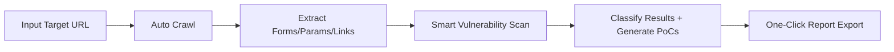

# 🔍 VulnAnalyzer 

**All-in-One Automated Vulnerability Detection & Analysis Platform**

[](README.md)
[](README.zh-cn.md)


> Supports manual code analysis and automated website scanning with **24+** vulnerability detection engines, automatic PoC generation, and a built-in **156+** PoC reference library.

---

## 📋 Table of Contents

- [Features](#-features)
- [Quick Start](#-quick-start)
- [Usage Guide](#-usage-guide)
- [Detection Capabilities](#-detection-capabilities)
- [PoC Reference Library](#-poc-reference-library)
- [Advanced Features](#-advanced-features)
- [API Documentation](#-api-documentation)
- [Project Structure](#-project-structure)
- [FAQ](#-faq)
- [Legal Notice](#-legal-notice)

---

## 🎯 Features

### Two Operation Modes

| Mode | Description |
|------|-------------|
| **Manual** | Paste code / HTTP requests for real-time vulnerability analysis |
| **Scan** | Enter a URL for automated crawling + full vulnerability detection |

### Automated Pipeline



### Core Capabilities

- **24+** vulnerability types detected
- **SSE streaming** — real-time scan progress updates
- **Heuristic matching** + code pattern recognition
- **Automatic PoC generation**
- **Risk level classification** (Info / Low / Medium / High / Critical)
- **CWE / OWASP** standard references
- **Precise line:column** source location
- **Code line preview** — shows matching source code directly
- **JSON report export**

---

## 🚀 Quick Start

### Requirements

- Python 3.8+
- pip package manager

### Installation & Launch

```bash
# 1. Clone the repository
git clone https://github.com/kabuqin/VulnAnalyzer.git
cd VulnAnalyzer

# 2. Install dependencies
pip install flask requests

# 3. Start the server
python app.py

# 4. Open your browser
# http://127.0.0.1:5000
```

---

## 📖 Usage Guide

### Mode 1: Manual Analysis

1. Click the **Manual** tab
2. Paste code or an HTTP request into the input area
3. Click **Analyze**
4. Review the detection results

**Supported Input Types:**
- HTTP requests (GET / POST / PUT / DELETE etc.)
- HTML source code
- Java / Python / PHP / JavaScript code snippets

**Example Input:**

```http
POST /admin/upload?id=1&redirect=http://evil.com HTTP/1.1
Host: example.com
Content-Type: application/x-www-form-urlencoded

username=admin&password=password
```

### Mode 2: Automated Scan

1. Click the **Scan** tab
2. Enter a target URL (e.g., `https://example.com`)
3. Click **Scan Target**
4. Watch real-time progress updates via SSE
5. Review results once the scan completes

### Mode 3: PoC Reference Library

The project includes a comprehensive PoC reference library covering all **PortSwigger Web Security Academy** lab categories:

1. Click the **PoC** button in the navigation bar
2. The left panel shows **All** and **24 category buttons**
3. Click **All** to view all 156+ payloads
4. Click a specific category (e.g., SQL Injection) to filter
5. Use the **search box** for keyword filtering
6. Click **Copy** to copy any payload to your clipboard

---

## 🔍 Detection Capabilities

### Vulnerability Types (24+)

| Vulnerability | Risk Level | Detection Method |
|--------------|:--------:|------------------|
| XSS (with taint chain tracking) | **HIGH** | DOM source→sink, parameter reflection, template expressions |
| SQL Injection | HIGH | String concatenation, error messages, parameter patterns |
| SSTI (Template Injection) | **HIGH** | Jinja2 / Twig / Freemarker / Velocity / Thymeleaf |
| Command Injection | HIGH | Runtime.exec / ProcessBuilder / child_process |
| Path Traversal | HIGH | `../` sequence detection |
| SSRF (with chained SSRF) | **HIGH** | URL construction, private network detection, dataUrl chains |
| Open Redirect | Medium | Redirect parameter analysis |
| File Upload | HIGH | Form detection, validation flags |
| XXE | **Critical** | DOCTYPE detection |
| Insecure Deserialization | **Critical** | ObjectInputStream / Jackson / SnakeYAML |
| CORS Misconfiguration | Medium | Wildcard origin detection |
| Sensitive Information Exposure | HIGH | API keys, secrets, credential detection |
| Authorization Bypass | HIGH | Direct parameter control, sensitive routes |
| Cryptographic Weakness | HIGH | ECB, MD5, SHA1, weak TLS |
| Log Injection | Medium | Log concatenation detection |
| SpEL Injection | **Critical** | Expression parsing |
| Unsafe Reflection | **Critical** | Class.forName / ClassLoader |
| Missing Security Headers | Low | Response header checks |
| Missing Error Handling | **Medium** | async without try/catch, fetch without .catch() |
| CSRF | HIGH | Token validation |
| JWT Attacks | HIGH | Signature validation |
| HTTP Request Smuggling | **Critical** | Content-Length / Transfer-Encoding parsing |
| NoSQL Injection | HIGH | Parameter pattern analysis |
| WebSocket | Medium | Origin validation |
| GraphQL | Medium | Batch queries / introspection |

### Each Finding Includes

- **Location** — exact **line:column** in source
- **Code Preview** — the matching source line displayed inline
- **Evidence** — why it was flagged as a vulnerability
- **Verification Steps** — how to manually confirm
- **PoC** — automatically generated test payload
- **CWE / OWASP** — standard classification references

---

## 📚 PoC Reference Library

Built-in PoC library covering all **PortSwigger Web Security Academy** lab categories with **156+ payloads**:

| Category | Count | Risk |
|----------|:----:|:----:|
| SQL Injection | 11 | Critical |
| XSS | 24 | High |
| SSTI | 10 | Critical |
| Path Traversal | 8 | High |
| Command Injection | 8 | Critical |
| XXE | 6 | High |
| SSRF | 8 | High |
| Open Redirect | 5 | Medium |
| CSRF | 5 | High |
| CORS | 4 | Medium |
| HTTP Request Smuggling | 5 | Critical |
| NoSQL Injection | 5 | High |
| JWT Attacks | 5 | High |
| Access Control / IDOR | 6 | High |
| File Upload | 6 | High |
| Insecure Deserialization | 6 | Critical |
| Web Cache Poisoning | 4 | Medium |
| Host Header Injection | 5 | Medium |
| GraphQL | 4 | Medium |
| Prototype Pollution | 4 | Medium |
| Clickjacking | 3 | Medium |
| WebSocket | 3 | Medium |
| Race Condition | 2 | High |
| LLM Attacks | 11 | Medium |

**XSS Harmless Test Pack** — 10 payloads using `console.log` instead of `alert` for safe testing in non-production environments.

**One-Click Copy** — all payloads can be copied to clipboard with a single click.

---

## ✨ Advanced Features

### XSS Taint Chain Tracking 🔗

Detects complete source→sink data flow:

```
URLSearchParams → params.get('userId') → fetch('/api/profile/') → ... → innerHTML
```

Flags as **HIGH** when DOM data sources (URL params, location, etc.) flow into DOM sinks (innerHTML, eval, etc.).

### Chained SSRF Detection 🌐

Detects when a fetch response field is directly used in a subsequent fetch:

```javascript
const meta = await fetch('/api/doc/1').then(r => r.json());
const data = await fetch(meta.dataUrl).then(r => r.json());  // ← chained SSRF
```

### SSTI (Server-Side Template Injection) 🧩

| Template Engine | Detection Pattern |
|----------------|-------------------|
| Jinja2 / Twig | `{{...}}`, `` + user variables |
| Freemarker / Velocity | `${...}` expressions |
| Thymeleaf | `th:text`, `th:utext` attributes |
| Flask | `render_template_string()` + request data |
| Nunjucks / EJS | `compile()`, `render()` API |
| Smarty / Blade | PHP template rendering functions |

### SSE Streaming Scan Progress 📊

Scan mode uses **Server-Sent Events (SSE)** for real-time progress updates:

```
[15:30:01] Target: https://example.com
[15:30:02] Crawling: page 1/10
[15:30:05] Found 3 forms, 12 params
[15:30:06] Analyzing page 2/10...
[15:30:30] Scan complete! Found 8 issues.
```

### Missing Error Handling ⚠️

- Detects async functions missing `try/catch`
- Detects fetch calls missing `.catch()` error handling

### Line:Column Location 📍

All findings display precise **line:column** locations instead of obscure character offsets, with the matching source code shown inline.

---

## 🔌 API Documentation

### POST /analyze

Manual code analysis

```bash
curl -X POST http://127.0.0.1:5000/analyze \
  -H "Content-Type: application/json" \
  -d '{
    "text": "GET /admin?id=1 HTTP/1.1",
    "min_risk": "info",
    "types": ["XSS", "SQL Injection"]
  }'
```

**Parameters:**
- `text` (string) — code / request to analyze
- `min_risk` (string) — minimum risk level: info / low / medium / high / critical
- `types` (array) — limit to specific vulnerability types (empty = all)

### POST /crawl

Crawl a website and extract parameters

```bash
curl -X POST http://127.0.0.1:5000/crawl \
  -H "Content-Type: application/json" \
  -d '{
    "target": "https://example.com",
    "max_pages": 30
  }'
```

### POST /scan-target

Full automated scan (non-streaming)

```bash
curl -X POST http://127.0.0.1:5000/scan-target \
  -H "Content-Type: application/json" \
  -d '{
    "target": "https://example.com",
    "min_risk": "info"
  }'
```

### POST /scan-stream

SSE real-time streaming scan (with progress updates)

```bash
curl -X POST http://127.0.0.1:5000/scan-stream \
  -H "Content-Type: application/json" \
  -d '{"target": "https://example.com"}'
```

---

## ⚙️ Project Structure

```
VulnAnalyzer/
├── app.py                    # Flask server (routes + SSE streaming)
├── vuln_analyzer.py         # Detection engine (2400+ lines, 24+ vuln types)
├── crawler.py               # Website crawler (forms/params/links extraction)
├── static/
│   ├── index.html           # Frontend UI (dark theme w/ PoC library panel)
│   └── poc_data.js          # PoC reference data (24 categories, 156+ payloads)
├── README.md                # English documentation
├── README.zh-cn.md          # Chinese documentation
└── .gitignore
```

---

## ❓ FAQ

### Q: Why are there so many findings?

A: VulnAnalyzer uses heuristic detection and may produce false positives. Filter by risk level and manually verify with the provided PoCs.

### Q: Does it support HTTPS?

A: Yes. SSL verification is disabled by default. Set `verify_ssl=True` in `crawler.py` if needed.

### Q: Does it support JavaScript rendering?

A: No. The crawler only parses static HTML.

### Q: How do I add a new vulnerability type?

A: Edit `vuln_analyzer.py`, add a new `analyze_xxx()` function, and register it in the main `analyze()` function.

### Q: Are the PoC payloads safe to browse?

A: Yes. The PoC library uses pure DOM API rendering — all payloads are set via `textContent` and `dataset`, preventing any script execution. The XSS Harmless Test Pack uses `console.log` instead of `alert` for safe testing scenarios.

---

## ⚠️ Legal Notice

**For Authorized Security Testing Only**

- ✅ Your own projects
- ✅ Explicitly authorized targets
- ❌ Unauthorized website scanning (illegal)

---

## 📈 Performance Metrics

| Task | Duration |
|------|:-------:|
| Single code snippet analysis | 1–10 ms |
| Single page crawl | 1–3 s |
| Full scan (30 pages) | 2–5 min |
| Memory usage | 50–100 MB |

---

**VulnAnalyzer v2.2** | Educational Use Only | [English](README.md) | [中文](README.zh-cn.md)
# 🔍 VulnAnalyzer 2.2

**一个全能的自动化漏洞检测与分析平台**

支持手动代码分析和自动网站扫描，内置 **20+** 漏洞类型检测引擎，自动生成测试 PoC。


---

## 📋 快速导航

- [功能特性](#功能特性)
- [快速开始](#快速开始)
- [使用指南](#使用指南)
- [检测能力](#检测能力)
- [增强特性](#增强特性)
- [API 文档](#api-文档)
- [项目结构](#项目结构)
- [常见问题](#常见问题)

---

## 🎯 功能特性

### 核心功能

✅ **两种工作模式**
- **手动分析**：粘贴代码/HTTP请求，实时检测漏洞
- **自动扫描**：输入URL，自动爬取网站并检测全部漏洞

✅ **自动化流程**
- 网站自动爬取（识别表单、参数、链接）
- 智能参数提取
- 自动漏洞检测
- 一键生成报告

✅ **智能分析**
- 20+ 种漏洞类型检测
- 启发式匹配 + 代码模式识别
- 自动 PoC 生成
- 风险等级分类

✅ **完整报告**
- JSON 导出
- CWE/OWASP 引用
- 验证步骤指导
- 修复建议
- **行号定位** — 精确到源代码行:列
- **代码行预览** — 直接展示匹配代码

---

## 🚀 快速开始

### 系统要求

- Python 3.8+
- pip 包管理器

### 安装步骤

```bash
# 1. 克隆仓库
git clone https://github.com/kabuqin/VulnAnalyzer.git
cd VulnAnalyzer

# 2. 安装依赖
pip install flask requests

# 3. 启动服务
python app.py

# 4. 打开浏览器
# http://127.0.0.1:5000
```

---

## 📖 使用指南

### 模式 1：手动分析（Manual Mode）

1. 打开网页，在 "Manual" 标签
2. 粘贴代码/HTTP请求
3. 点击 "Analyze"
4. 查看检测结果

**支持的输入类型：**
- HTTP 请求（GET/POST/PUT/DELETE 等）
- HTML 源代码
- Java/Python/PHP/JavaScript 代码片段

**示例输入：**
```http
POST /admin/upload?id=1&redirect=http://evil.com HTTP/1.1
Host: example.com
Content-Type: application/x-www-form-urlencoded

username=admin&password=password
```

### 模式 2：自动扫描（Scan Mode）

1. 点击 "Scan" 标签
2. 输入目标 URL（如 `https://example.com`）
3. 设置最大页数（默认 30）
4. 点击 "Scan Target"
5. 等待扫描完成

---

## 🔍 检测能力

### 漏洞类型（20+ 种）

| 漏洞类型 | 风险级别 | 检测方式 |
|---------|:-------:|---------|
| XSS（含污染链追踪） | **HIGH** | DOM source→sink、参数反射、模板表达式 |
| SQL 注入 | HIGH | 字符串拼接、错误信息、参数特征 |
| SSTI（模板注入） | **HIGH** | Jinja2/Twig/Freemarker/Velocity/Thymeleaf 模板引擎 |
| 命令注入 | HIGH | Runtime/ProcessBuilder/child_process |
| 路径遍历 | HIGH | ../ 序列检测 |
| SSRF（含链式SSRF） | **HIGH** | URL 构造、私网检测、dataUrl 链 |
| 开放重定向 | Medium | redirect 参数分析 |
| 文件上传 | HIGH | 表单检测、验证标志 |
| XXE | Critical | DOCTYPE 检测 |
| 反序列化 | Critical | ObjectInputStream |
| CORS 错误 | Medium | 通配符检测 |
| 敏感信息泄露 | HIGH | API Key、密钥识别 |
| 授权绕过 | HIGH | 参数直控、敏感路由 |
| 加密弱点 | HIGH | ECB、MD5、弱 TLS |
| Log 注入 | Medium | 日志拼接检测 |
| SpEL 注入 | Critical | 表达式解析 |
| 不安全反射 | Critical | Class.forName |
| 安全头缺失 | Low | 响应头检查 |
| 错误处理缺失 | **Medium** | async 无 try/catch、fetch 无 .catch() |

### 每个漏洞都包含

- **位置信息** — 精确指出 **第X行 第Y列**
- **代码预览** — 直接展示匹配到的源代码行
- **证据** — 为什么认为存在此漏洞
- **验证步骤** — 如何进一步验证
- **PoC** — 自动生成的测试代码
- **CWE/OWASP** — 标准分类引用

---

## ✨ 增强特性

### XSS 污染链追踪 🔗

检测完整的 source→sink 数据流：

```
URLSearchParams → params.get('userId') → fetch('/api/profile/') → ... → innerHTML
```

当检测到 DOM 数据源（URL参数、location等）流向 DOM 写入点（innerHTML、eval等）时，标记为 **HIGH** 级别。

### 链式 SSRF 检测 🌐

检测一个 fetch 响应的字段被直接用于下一个 fetch 的安全风险：

```javascript
const meta = await fetch('/api/doc/1').then(r => r.json());
const data = await fetch(meta.dataUrl).then(r => r.json());  // ← 链式SSRF
```

### SSTI（服务端模板注入）🧩

| 模板引擎 | 检测模式 |
|---------|---------|
| Jinja2 / Twig | `{{...}}`, `` + 用户变量 |
| Freemarker / Velocity | `${...}` 表达式 |
| Thymeleaf | `th:text`, `th:utext` 属性 |
| Flask | `render_template_string()` + 请求数据 |
| Nunjucks / EJS | `compile()`, `render()` API |
| Smarty / Blade | PHP 模板渲染函数 |

### 缺失错误处理 ⚠️

- 检测 async 函数缺少 `try/catch`
- 检测 fetch 调用缺少 `.catch()` 错误处理

### 行号定位 📍

所有发现不再使用晦涩的字符偏移量，而是展示 **第X行 第Y列**，并在详情中直接显示匹配到的源代码行。

---

## 🔌 API 文档

### POST /analyze

手动代码分析

```bash
curl -X POST http://127.0.0.1:5000/analyze \
  -H "Content-Type: application/json" \
  -d '{
    "text": "GET /admin?id=1 HTTP/1.1",
    "min_risk": "info",
    "types": ["XSS", "SQL Injection"]
  }'
```

**参数：**
- `text` (string) — 要分析的代码/请求
- `min_risk` (string) — 最低风险：info/low/medium/high/critical
- `types` (array) — 只检测指定类型，不填则全检

### POST /crawl

网站爬取与参数提取

```bash
curl -X POST http://127.0.0.1:5000/crawl \
  -H "Content-Type: application/json" \
  -d '{
    "target": "https://example.com",
    "max_pages": 30
  }'
```

### POST /scan-target

完整自动扫描

```bash
curl -X POST http://127.0.0.1:5000/scan-target \
  -H "Content-Type: application/json" \
  -d '{
    "target": "https://example.com",
    "min_risk": "info"
  }'
```

### POST /scan-stream

SSE 实时流式扫描（带进度推送）

```bash
curl -X POST http://127.0.0.1:5000/scan-stream \
  -H "Content-Type: application/json" \
  -d '{"target": "https://example.com"}'
```

---

## ⚙️ 项目结构

```
vulnanalyzer/
├── app.py                    # Flask 服务器（路由 + SSE）
├── vuln_analyzer.py         # 检测引擎（2300+ 行）
├── crawler.py               # 网站爬虫
├── static/
│   └── index.html          # 前端 UI（深色主题）
├── README.md               # 文档
└── .gitignore
```

---

## 📊 检测示例

### XSS 污染链
```
输入: <script>const x = params.get('name');
      document.getElementById('bio').innerHTML = x;</script>

输出: [HIGH] XSS · 第1行 → 第2行
      污染链: URLSearchParams → innerHTML
      PoC: 
```

### SSTI（Flask 模板注入）
```
输入: return render_template_string('Hello ' + name)

输出: [HIGH] SSTI · 第3行
      Flask render_template_string() with request data
      PoC: {{config.__class__.__init__.__globals__['os'].popen('id').read()}}
```

### 链式 SSRF
```
输入: fetch(profileMeta.dataUrl)

输出: [HIGH] SSRF · 第5行
      Chained SSRF: fetch response field used as URL in subsequent fetch
```

---

## ❓ 常见问题

### Q: 为什么有这么多漏洞检测结果？

A: VulnAnalyzer 使用启发式检测，会有误报。建议按风险等级过滤，并使用 PoC 进行手动验证。

### Q: 支持 HTTPS 吗？

A: 支持，默认跳过 SSL 验证。可修改 `crawler.py` 中的 `verify_ssl=True`。

### Q: 支持 JavaScript 渲染吗？

A: 不支持。爬虫仅解析静态 HTML。

### Q: 可以扫描需要登录的网站吗？

A: 当前版本不支持，可在未来版本添加。

### Q: 如何扩展新的漏洞类型？

A: 编辑 `vuln_analyzer.py`，添加新的 `analyze_xxx()` 函数，并在 `analyze()` 中注册。

---

## ⚠️ 法律声明

**仅用于授权安全测试**

- ✅ 自己的项目
- ✅ 获得明确授权的目标
- ❌ 未授权网站扫描（违法）

---

## 📈 性能指标

| 任务 | 耗时 |
|------|------|
| 单个代码片段分析 | 1-10ms |
| 爬取单个页面 | 1-3s |
| 30页网站完整扫描 | 2-5分钟 |
| 内存占用 | 50-100MB |

---

## 🙏 致谢

感谢 OWASP、CWE、Flask 社区的支持。

---

**VulnAnalyzer v2.2** | Educational Use Only

最后更新：2026-06-23
# 🔍 VulnAnalyzer 2.1

**一个全能的自动化漏洞检测与分析平台**

支持手动代码分析和自动网站扫描，内置 17+ 漏洞类型检测引擎，自动生成测试 PoC。


---

## 📋 快速导航

- [功能特性](#功能特性)
- [快速开始](#快速开始)
- [使用指南](#使用指南)
- [检测能力](#检测能力)
- [常见问题](#常见问题)

---

## 🎯 功能特性

### 核心功能

✅ **两种工作模式**
- **手动分析**：粘贴代码/HTTP请求，实时检测漏洞
- **自动扫描**：输入URL，自动爬取网站并检测全部漏洞

✅ **自动化流程**
- 网站自动爬取（识别表单、参数、链接）
- 智能参数提取
- 自动漏洞检测
- 一键生成报告

✅ **智能分析**
- 17+ 种漏洞类型检测
- 启发式匹配 + 代码模式识别
- 自动 PoC 生成
- 风险等级分类

✅ **完整报告**
- JSON/Markdown 导出
- CWE/OWASP 参考
- 验证步骤指导
- 修复建议

---

## 🚀 快速开始

### 系统要求

- Python 3.8+
- pip 包管理器

### 安装步骤

```bash
# 1. 创建目录并下载文件
mkdir vulnanalyzer
cd vulnanalyzer

# 下载以下文件：
# app.py
# vuln_analyzer.py
# crawler.py
# static_index.html (重命名为 index.html)

# 2. 创建静态文件夹
mkdir static
mv index.html static/

# 3. 安装依赖
pip install flask requests

# 4. 启动服务
python app.py

# 5. 打开浏览器
# http://127.0.0.1:5000
```

---

## 📖 使用指南

### 模式 1：手动分析（Manual Mode）

1. 打开网页，在 "Manual" 标签
2. 粘贴代码/HTTP请求
3. 点击 "Analyze"
4. 查看检测结果

**支持的输入类型：**
- HTTP 请求（GET/POST/PUT/DELETE 等）
- HTML 源代码
- Java/Python/PHP/JavaScript 代码片段

**示例输入：**
```http
POST /admin/upload?id=1&redirect=http://evil.com HTTP/1.1
Host: example.com
Content-Type: application/x-www-form-urlencoded

username=admin&password=password
```

### 模式 2：自动扫描（Scan Mode）

1. 点击 "Scan" 标签
2. 输入目标 URL（如 `https://example.com`）
3. 设置最大页数（默认 30）
4. 点击 "Scan Target"
5. 等待扫描完成

---

## 🔍 检测能力

### 漏洞类型（17+ 种）

| 漏洞类型 | 风险级别 | 检测方式 |
|---------|---------|---------|
| XSS | High | DOM sink、参数反射 |
| SQL 注入 | High | 字符串拼接、错误信息 |
| 命令注入 | High | Runtime/ProcessBuilder |
| 路径遍历 | High | ../ 序列检测 |
| SSRF | High | URL 构造、私网检测 |
| 开放重定向 | Medium | redirect 参数分析 |
| 文件上传 | High | 表单检测、验证标志 |
| XXE | Critical | DOCTYPE 检测 |
| 反序列化 | Critical | ObjectInputStream |
| CORS 错误 | Medium | 通配符检测 |
| 敏感信息泄露 | High | API Key、密钥识别 |
| 授权绕过 | High | 参数直控、敏感路由 |
| 加密弱点 | High | ECB、MD5、弱 TLS |
| Log 注入 | Medium | 日志拼接检测 |
| SpEL 注入 | Critical | 表达式解析 |
| 不安全反射 | Critical | Class.forName |
| 安全头缺失 | Low | 响应头检查 |

### 每个漏洞都包含

- **位置信息** - 准确指出漏洞位置
- **证据** - 为什么认为存在此漏洞
- **验证步骤** - 如何进一步验证
- **PoC** - 自动生成的测试代码
- **CWE/OWASP** - 标准参考

---

## 🔌 API 文档

### POST /analyze

手动代码分析

```bash
curl -X POST http://127.0.0.1:5000/analyze \
  -H "Content-Type: application/json" \
  -d '{
    "text": "GET /admin?id=1 HTTP/1.1",
    "min_risk": "info",
    "types": ["XSS", "SQL Injection"]
  }'
```

**参数：**
- `text` (string) - 要分析的代码/请求
- `min_risk` (string) - 最低风险：info/low/medium/high/critical
- `types` (array) - 只检测指定类型，不填则全检

### POST /crawl

网站爬取与参数提取

```bash
curl -X POST http://127.0.0.1:5000/crawl \
  -H "Content-Type: application/json" \
  -d '{
    "target": "https://example.com",
    "max_pages": 30
  }'
```

### POST /scan-target

完整自动扫描

```bash
curl -X POST http://127.0.0.1:5000/scan-target \
  -H "Content-Type: application/json" \
  -d '{
    "target": "https://example.com",
    "min_risk": "info"
  }'
```

---

## 📊 PoC 示例

### XSS
```javascript

" onmouseover="alert(1)" x="
<script>alert(1)</script>
```

### SQL 注入
```sql
' OR '1'='1
' UNION SELECT 1,2,3,4-- -
' AND SLEEP(5)-- -
```

### 命令注入
```bash
; id;
| cat /etc/passwd
&& sleep 5
```

### 路径遍历
```
../../../etc/passwd
..\..\..\..\windows\win.ini
..%2F..%2F..%2Fetc%2Fpasswd
```

---

## ⚙️ 项目结构

```
vulnanalyzer/
├── app.py                    # Flask 服务器
├── vuln_analyzer.py         # 检测引擎（2000+ 行）
├── crawler.py               # 网站爬虫
├── static/
│   └── index.html          # 前端 UI
├── README.md               # 文档
└── QUICKSTART.md           # 快速开始
```

---

## ❓ 常见问题

### Q: 为什么有这么多漏洞检测结果？

A: VulnAnalyzer 使用启发式检测，会有误报。建议按风险等级过滤，并使用 PoC 进行手动验证。

### Q: 支持 HTTPS 吗？

A: 支持，默认跳过 SSL 验证。可修改 `crawler.py` 中的 `verify_ssl=True`。

### Q: 支持 JavaScript 渲染吗？

A: 不支持。爬虫仅解析静态 HTML。

### Q: 可以扫描需要登录的网站吗？

A: 当前版本不支持，可在未来版本添加。

### Q: 如何扩展新的漏洞类型？

A: 编辑 `vuln_analyzer.py`，添加新的 `analyze_xxx()` 函数。

---

## ⚠️ 法律声明

**仅用于授权安全测试**

- ✅ 自己的项目
- ✅ 获得明确授权的目标
- ❌ 未授权网站扫描（违法）

---

## 📈 性能指标

| 任务 | 耗时 |
|------|------|
| 单个代码片段分析 | 50-150ms |
| 爬取单个页面 | 1-3s |
| 30页网站完整扫描 | 2-5分钟 |
| 内存占用 | 50-100MB |

---

## 🙏 致谢

感谢 OWASP、CWE、Flask 社区的支持。

---

**VulnAnalyzer v2.1** | Educational Use Only

最后更新：2026-06-14
