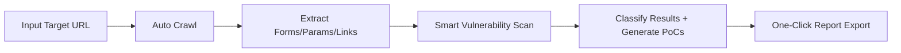
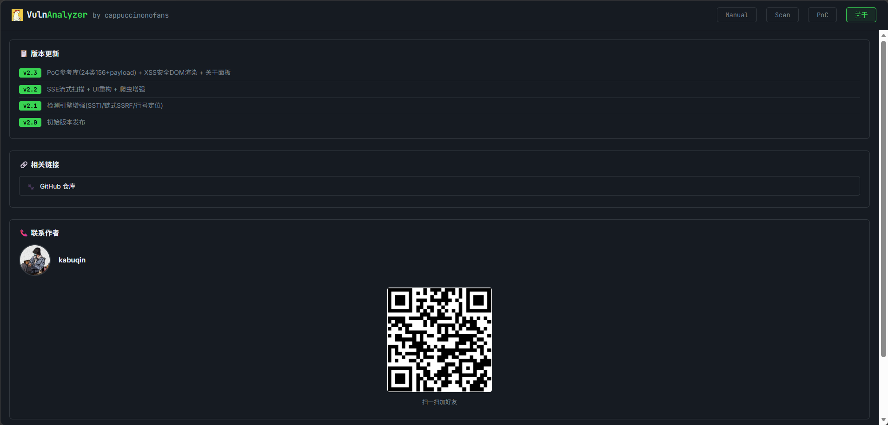

# 🔍 VulnAnalyzer 

**All-in-One Automated Vulnerability Detection & Analysis Platform**

[](README.md)
[](README.zh-cn.md)


> Supports manual code analysis and automated website scanning with **24+** vulnerability detection engines, automatic PoC generation, and a built-in **156+** PoC reference library.

---

## 📋 Table of Contents

- [Features](#-features)
- [Quick Start](#-quick-start)
- [Usage Guide](#-usage-guide)
- [Detection Capabilities](#-detection-capabilities)
- [PoC Reference Library](#-poc-reference-library)
- [Advanced Features](#-advanced-features)
- [API Documentation](#-api-documentation)
- [Project Structure](#-project-structure)
- [FAQ](#-faq)
- [Legal Notice](#-legal-notice)

---

## 🎯 Features

### Two Operation Modes

| Mode | Description |
|------|-------------|
| **Manual** | Paste code / HTTP requests for real-time vulnerability analysis |
| **Scan** | Enter a URL for automated crawling + full vulnerability detection |

### Automated Pipeline



### Core Capabilities

- **24+** vulnerability types detected
- **SSE streaming** — real-time scan progress updates
- **Heuristic matching** + code pattern recognition
- **Automatic PoC generation**
- **Risk level classification** (Info / Low / Medium / High / Critical)
- **CWE / OWASP** standard references
- **Precise line:column** source location
- **Code line preview** — shows matching source code directly
- **JSON report export**

---

## 🚀 Quick Start

### Requirements

- Python 3.8+
- pip package manager

### Installation & Launch

```bash
# 1. Clone the repository
git clone https://github.com/kabuqin/VulnAnalyzer.git
cd VulnAnalyzer

# 2. Install dependencies
pip install flask requests

# 3. Start the server
python app.py

# 4. Open your browser
# http://127.0.0.1:5000
```

---

## 📖 Usage Guide

### Mode 1: Manual Analysis

1. Click the **Manual** tab
2. Paste code or an HTTP request into the input area
3. Click **Analyze**
4. Review the detection results

**Supported Input Types:**
- HTTP requests (GET / POST / PUT / DELETE etc.)
- HTML source code
- Java / Python / PHP / JavaScript code snippets

**Example Input:**

```http
POST /admin/upload?id=1&redirect=http://evil.com HTTP/1.1
Host: example.com
Content-Type: application/x-www-form-urlencoded

username=admin&password=password
```

### Mode 2: Automated Scan

1. Click the **Scan** tab
2. Enter a target URL (e.g., `https://example.com`)
3. Click **Scan Target**
4. Watch real-time progress updates via SSE
5. Review results once the scan completes

### Mode 3: PoC Reference Library

The project includes a comprehensive PoC reference library covering all **PortSwigger Web Security Academy** lab categories:

1. Click the **PoC** button in the navigation bar
2. The left panel shows **All** and **24 category buttons**
3. Click **All** to view all 156+ payloads
4. Click a specific category (e.g., SQL Injection) to filter
5. Use the **search box** for keyword filtering
6. Click **Copy** to copy any payload to your clipboard

---

## 🔍 Detection Capabilities

### Vulnerability Types (24+)

| Vulnerability | Risk Level | Detection Method |
|--------------|:--------:|------------------|
| XSS (with taint chain tracking) | **HIGH** | DOM source→sink, parameter reflection, template expressions |
| SQL Injection | HIGH | String concatenation, error messages, parameter patterns |
| SSTI (Template Injection) | **HIGH** | Jinja2 / Twig / Freemarker / Velocity / Thymeleaf |
| Command Injection | HIGH | Runtime.exec / ProcessBuilder / child_process |
| Path Traversal | HIGH | `../` sequence detection |
| SSRF (with chained SSRF) | **HIGH** | URL construction, private network detection, dataUrl chains |
| Open Redirect | Medium | Redirect parameter analysis |
| File Upload | HIGH | Form detection, validation flags |
| XXE | **Critical** | DOCTYPE detection |
| Insecure Deserialization | **Critical** | ObjectInputStream / Jackson / SnakeYAML |
| CORS Misconfiguration | Medium | Wildcard origin detection |
| Sensitive Information Exposure | HIGH | API keys, secrets, credential detection |
| Authorization Bypass | HIGH | Direct parameter control, sensitive routes |
| Cryptographic Weakness | HIGH | ECB, MD5, SHA1, weak TLS |
| Log Injection | Medium | Log concatenation detection |
| SpEL Injection | **Critical** | Expression parsing |
| Unsafe Reflection | **Critical** | Class.forName / ClassLoader |
| Missing Security Headers | Low | Response header checks |
| Missing Error Handling | **Medium** | async without try/catch, fetch without .catch() |
| CSRF | HIGH | Token validation |
| JWT Attacks | HIGH | Signature validation |
| HTTP Request Smuggling | **Critical** | Content-Length / Transfer-Encoding parsing |
| NoSQL Injection | HIGH | Parameter pattern analysis |
| WebSocket | Medium | Origin validation |
| GraphQL | Medium | Batch queries / introspection |

### Each Finding Includes

- **Location** — exact **line:column** in source
- **Code Preview** — the matching source line displayed inline
- **Evidence** — why it was flagged as a vulnerability
- **Verification Steps** — how to manually confirm
- **PoC** — automatically generated test payload
- **CWE / OWASP** — standard classification references

---

## 📚 PoC Reference Library

Built-in PoC library covering all **PortSwigger Web Security Academy** lab categories with **156+ payloads**:

| Category | Count | Risk |
|----------|:----:|:----:|
| SQL Injection | 11 | Critical |
| XSS | 24 | High |
| SSTI | 10 | Critical |
| Path Traversal | 8 | High |
| Command Injection | 8 | Critical |
| XXE | 6 | High |
| SSRF | 8 | High |
| Open Redirect | 5 | Medium |
| CSRF | 5 | High |
| CORS | 4 | Medium |
| HTTP Request Smuggling | 5 | Critical |
| NoSQL Injection | 5 | High |
| JWT Attacks | 5 | High |
| Access Control / IDOR | 6 | High |
| File Upload | 6 | High |
| Insecure Deserialization | 6 | Critical |
| Web Cache Poisoning | 4 | Medium |
| Host Header Injection | 5 | Medium |
| GraphQL | 4 | Medium |
| Prototype Pollution | 4 | Medium |
| Clickjacking | 3 | Medium |
| WebSocket | 3 | Medium |
| Race Condition | 2 | High |
| LLM Attacks | 11 | Medium |

**XSS Harmless Test Pack** — 10 payloads using `console.log` instead of `alert` for safe testing in non-production environments.

**One-Click Copy** — all payloads can be copied to clipboard with a single click.

---

## ✨ Advanced Features

### XSS Taint Chain Tracking 🔗

Detects complete source→sink data flow:

```
URLSearchParams → params.get('userId') → fetch('/api/profile/') → ... → innerHTML
```

Flags as **HIGH** when DOM data sources (URL params, location, etc.) flow into DOM sinks (innerHTML, eval, etc.).

### Chained SSRF Detection 🌐

Detects when a fetch response field is directly used in a subsequent fetch:

```javascript
const meta = await fetch('/api/doc/1').then(r => r.json());
const data = await fetch(meta.dataUrl).then(r => r.json());  // ← chained SSRF
```

### SSTI (Server-Side Template Injection) 🧩

| Template Engine | Detection Pattern |
|----------------|-------------------|
| Jinja2 / Twig | `{{...}}`, `` + user variables |
| Freemarker / Velocity | `${...}` expressions |
| Thymeleaf | `th:text`, `th:utext` attributes |
| Flask | `render_template_string()` + request data |
| Nunjucks / EJS | `compile()`, `render()` API |
| Smarty / Blade | PHP template rendering functions |

### SSE Streaming Scan Progress 📊

Scan mode uses **Server-Sent Events (SSE)** for real-time progress updates:

```
[15:30:01] Target: https://example.com
[15:30:02] Crawling: page 1/10
[15:30:05] Found 3 forms, 12 params
[15:30:06] Analyzing page 2/10...
[15:30:30] Scan complete! Found 8 issues.
```

### Missing Error Handling ⚠️

- Detects async functions missing `try/catch`
- Detects fetch calls missing `.catch()` error handling

### Line:Column Location 📍

All findings display precise **line:column** locations instead of obscure character offsets, with the matching source code shown inline.

---

## 🔌 API Documentation

### POST /analyze

Manual code analysis

```bash
curl -X POST http://127.0.0.1:5000/analyze \
  -H "Content-Type: application/json" \
  -d '{
    "text": "GET /admin?id=1 HTTP/1.1",
    "min_risk": "info",
    "types": ["XSS", "SQL Injection"]
  }'
```

**Parameters:**
- `text` (string) — code / request to analyze
- `min_risk` (string) — minimum risk level: info / low / medium / high / critical
- `types` (array) — limit to specific vulnerability types (empty = all)

### POST /crawl

Crawl a website and extract parameters

```bash
curl -X POST http://127.0.0.1:5000/crawl \
  -H "Content-Type: application/json" \
  -d '{
    "target": "https://example.com",
    "max_pages": 30
  }'
```

### POST /scan-target

Full automated scan (non-streaming)

```bash
curl -X POST http://127.0.0.1:5000/scan-target \
  -H "Content-Type: application/json" \
  -d '{
    "target": "https://example.com",
    "min_risk": "info"
  }'
```

### POST /scan-stream

SSE real-time streaming scan (with progress updates)

```bash
curl -X POST http://127.0.0.1:5000/scan-stream \
  -H "Content-Type: application/json" \
  -d '{"target": "https://example.com"}'
```

---

## ⚙️ Project Structure

```
VulnAnalyzer/
├── app.py                    # Flask server (routes + SSE streaming)
├── vuln_analyzer.py         # Detection engine (2400+ lines, 24+ vuln types)
├── crawler.py               # Website crawler (forms/params/links extraction)
├── static/
│   ├── index.html           # Frontend UI (dark theme w/ PoC library panel)
│   └── poc_data.js          # PoC reference data (24 categories, 156+ payloads)
├── README.md                # English documentation
├── README.zh-cn.md          # Chinese documentation
└── .gitignore
```

---

## ❓ FAQ

### Q: Why are there so many findings?

A: VulnAnalyzer uses heuristic detection and may produce false positives. Filter by risk level and manually verify with the provided PoCs.

### Q: Does it support HTTPS?

A: Yes. SSL verification is disabled by default. Set `verify_ssl=True` in `crawler.py` if needed.

### Q: Does it support JavaScript rendering?

A: No. The crawler only parses static HTML.

### Q: How do I add a new vulnerability type?

A: Edit `vuln_analyzer.py`, add a new `analyze_xxx()` function, and register it in the main `analyze()` function.

### Q: Are the PoC payloads safe to browse?

A: Yes. The PoC library uses pure DOM API rendering — all payloads are set via `textContent` and `dataset`, preventing any script execution. The XSS Harmless Test Pack uses `console.log` instead of `alert` for safe testing scenarios.

---

## ⚠️ Legal Notice

**For Authorized Security Testing Only**

- ✅ Your own projects
- ✅ Explicitly authorized targets
- ❌ Unauthorized website scanning (illegal)

---

## 📈 Performance Metrics

| Task | Duration |
|------|:-------:|
| Single code snippet analysis | 1–10 ms |
| Single page crawl | 1–3 s |
| Full scan (30 pages) | 2–5 min |
| Memory usage | 50–100 MB |

---



